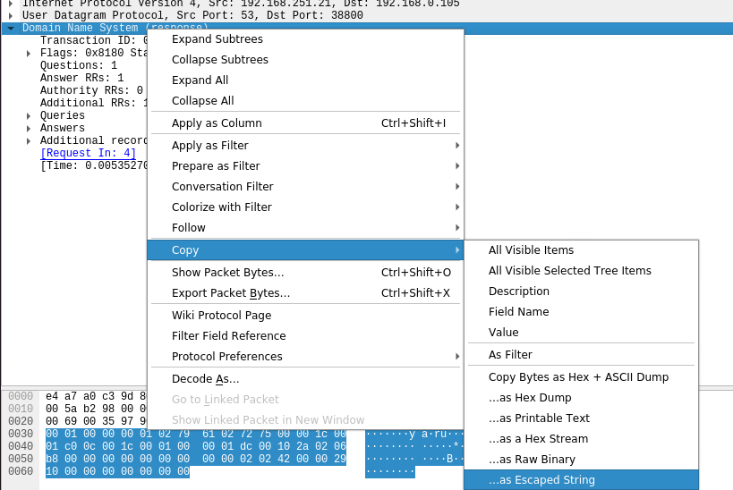

# DNSMessageParser

it's a project where I do fun with github actions.

_____
read stdin

expect to receive "Escaped string  of dns message" from Wireshark

print it in (almost) human readable format to stdout
